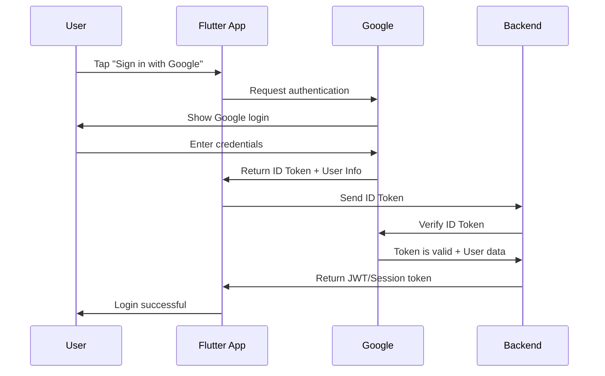

# Google Sign-In Flow và Token Management

## 🔍 Tại sao cần ID Token?

Khi sử dụng Google Sign-In, bạn **KHÔNG NÊN** tin tưởng thông tin user từ client-side. Thay vào đó, bạn cần:

1. **Client** nhận ID Token từ Google
2. **Client** gửi ID Token lên **Backend**
3. **Backend** verify ID Token với Google servers
4. **Backend** tạo session/JWT token cho app

## 🔄 Complete Flow



## 📱 Client-side (Flutter)

### Trước khi refactor (SAI):
```dart
// ❌ Chỉ lấy thông tin user, không có token
final GoogleSignInAccount googleUser = await _googleSignIn.authenticate();
// Gửi thông tin user lên backend (KHÔNG AN TOÀN)
```

### Sau khi refactor (ĐÚNG):
```dart
// ✅ Lấy cả user info và ID token
final GoogleSignInAccount googleUser = await _googleSignIn.authenticate();
final GoogleSignInAuthentication googleAuth = googleUser.authentication;

// Gửi ID Token lên backend để verify
final result = await BackendService.verifyGoogleToken(
  idToken: googleAuth.idToken!,
);
```

## 🖥️ Backend Implementation

### Node.js/Express Example:
```javascript
const { OAuth2Client } = require('google-auth-library');
const client = new OAuth2Client(CLIENT_ID);

app.post('/auth/google', async (req, res) => {
  try {
    const { idToken } = req.body;
    
    // Verify token với Google
    const ticket = await client.verifyIdToken({
      idToken: idToken,
      audience: CLIENT_ID,
    });
    
    const payload = ticket.getPayload();
    const userId = payload['sub'];
    const email = payload['email'];
    const name = payload['name'];
    
    // Tạo user trong database nếu chưa có
    const user = await findOrCreateUser({ userId, email, name });
    
    // Tạo JWT token cho app
    const appToken = jwt.sign({ userId: user.id }, JWT_SECRET);
    
    res.json({
      token: appToken,
      user: user,
      expiresAt: new Date(Date.now() + 24 * 60 * 60 * 1000) // 24h
    });
  } catch (error) {
    res.status(401).json({ error: 'Invalid token' });
  }
});
```

### Python/Django Example:
```python
from google.auth.transport import requests
from google.oauth2 import id_token

def verify_google_token(request):
    try:
        token = request.data.get('idToken')
        
        # Verify token với Google
        idinfo = id_token.verify_oauth2_token(
            token, requests.Request(), CLIENT_ID
        )
        
        user_id = idinfo['sub']
        email = idinfo['email']
        name = idinfo['name']
        
        # Tạo hoặc lấy user
        user, created = User.objects.get_or_create(
            google_id=user_id,
            defaults={'email': email, 'name': name}
        )
        
        # Tạo JWT token
        token = jwt.encode({'user_id': user.id}, SECRET_KEY)
        
        return Response({
            'token': token,
            'user': UserSerializer(user).data
        })
    except ValueError:
        return Response({'error': 'Invalid token'}, status=401)
```

## 🔧 Flutter Implementation

### AuthService với token handling:
```dart
Future<AuthResult> signInWithGoogle() async {
  try {
    // 1. Authenticate với Google
    final GoogleSignInAccount googleUser = await _googleSignIn.authenticate();
    final GoogleSignInAuthentication googleAuth = googleUser.authentication;
    
    // 2. Gửi ID Token lên backend
    final backendResult = await BackendService.verifyGoogleToken(
      idToken: googleAuth.idToken!,
    );
    
    if (backendResult['success']) {
      // 3. Lưu JWT token từ backend
      final appToken = backendResult['data']['token'];
      await _saveToken(appToken);
      
      return AuthResult.success(
        message: 'Đăng nhập thành công!',
        data: backendResult['data'],
      );
    } else {
      throw Exception(backendResult['error']);
    }
  } catch (e) {
    return AuthResult.failure(error: e.toString());
  }
}
```

## 🔐 Security Benefits

### ID Token Verification:
1. **Tamper-proof**: Token được Google ký, không thể giả mạo
2. **Time-limited**: Token có expiration time
3. **Audience-specific**: Token chỉ valid cho CLIENT_ID của bạn
4. **Server-side verification**: Backend verify trực tiếp với Google

### Tại sao không tin tưởng client-side data:
```dart
// ❌ NGUY HIỂM - Client có thể fake data này
final fakeUser = {
  'email': 'admin@company.com',
  'name': 'Fake Admin',
  'id': '123456789'
};

// ✅ AN TOÀN - ID Token không thể fake được
final idToken = googleAuth.idToken; // Signed by Google
```

## 📊 Token Properties

### ID Token chứa:
- `sub`: Google User ID (unique)
- `email`: Email address
- `name`: Full name
- `picture`: Profile picture URL
- `iat`: Issued at time
- `exp`: Expiration time
- `aud`: Audience (your CLIENT_ID)

### Example ID Token payload:
```json
{
  "sub": "107590472075965177434",
  "email": "duynguyen257946@gmail.com",
  "name": "Nguyễn Duy",
  "picture": "https://lh3.googleusercontent.com/a/...",
  "iat": 1703123456,
  "exp": 1703127056,
  "aud": "644453893178-kdnessqktdsaqsa0gkif8p87cjl43rk1.apps.googleusercontent.com"
}
```

## 🚀 Best Practices

1. **Always verify tokens server-side**
2. **Never trust client-side user data**
3. **Use HTTPS for all API calls**
4. **Store JWT tokens securely** (Flutter Secure Storage)
5. **Implement token refresh** mechanism
6. **Handle token expiration** gracefully

## 🔧 Testing

### Test ID Token manually:
1. Copy ID Token từ app logs
2. Paste vào: https://jwt.io/
3. Verify signature với Google's public keys

### Test backend verification:
```bash
curl -X POST https://your-api.com/auth/google \
  -H "Content-Type: application/json" \
  -d '{"idToken": "YOUR_ID_TOKEN_HERE"}'
```

## 📝 Summary

- **Client**: Lấy ID Token từ Google
- **Backend**: Verify ID Token với Google
- **Result**: Secure authentication flow
- **Benefits**: Tamper-proof, server-verified authentication
