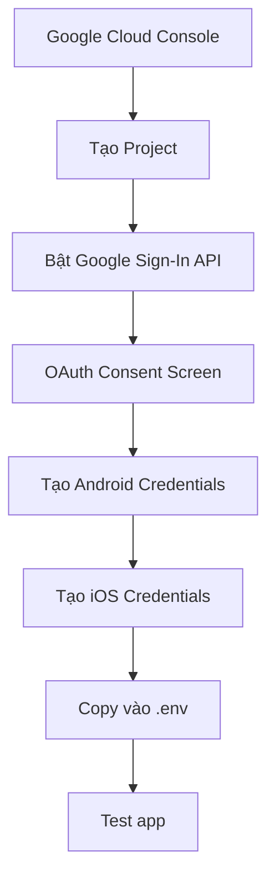

# Quick Start: Lấy Google Sign-In Credentials

## TL;DR - Các bước nhanh

1. **Google Cloud Console** → Tạo project → Bật Google Sign-In API
2. **OAuth Consent Screen** → Cấu hình app info
3. **Credentials** → Tạo OAuth 2.0 Client IDs cho Android/iOS
4. **SHA-1** → `keytool -list -v -keystore ~/.android/debug.keystore -alias androiddebugkey -storepass android -keypass android`
5. **Copy credentials** → Paste vào `.env`

## Thông tin cần lấy

| Thông tin | Từ đâu | Paste vào |
|-----------|--------|-----------|
| Android Client ID | Google Cloud Console > Credentials | `GOOGLE_ANDROID_CLIENT_ID` |
| iOS Client ID | Google Cloud Console > Credentials | `GOOGLE_IOS_CLIENT_ID` |
| Reversed Client ID | Tính từ iOS Client ID | `GOOGLE_REVERSED_CLIENT_ID` |
| SHA-1 Fingerprint | Terminal với keytool | Google Cloud Console |

## Commands cần thiết

### Lấy SHA-1 (Debug):
```bash
keytool -list -v -keystore ~/.android/debug.keystore -alias androiddebugkey -storepass android -keypass android
```

### Lấy SHA-1 (Release):
```bash
keytool -list -v -keystore /path/to/release.keystore -alias your-alias
```

### Copy .env template:
```bash
cp .env.example .env
```

## Công thức Reversed Client ID

Từ iOS Client ID:
```
123456789012-abcdefghijklmnopqrstuvwxyz123456.apps.googleusercontent.com
```

Thành Reversed Client ID:
```
com.googleusercontent.apps.123456789012-abcdefghijklmnopqrstuvwxyz123456
```

**Pattern**: `com.googleusercontent.apps.{PHẦN_TRƯỚC_DẤU_CHẤM_ĐẦU_TIÊN}`

## File .env mẫu

```env
# Thay thế bằng giá trị thực tế
GOOGLE_ANDROID_CLIENT_ID=123456789012-xxxxxxxxxxxxxxxxxxxxxxxxxxxxxxxx.apps.googleusercontent.com
GOOGLE_IOS_CLIENT_ID=123456789012-yyyyyyyyyyyyyyyyyyyyyyyyyyyyyyyy.apps.googleusercontent.com
GOOGLE_REVERSED_CLIENT_ID=com.googleusercontent.apps.123456789012-yyyyyyyyyyyyyyyyyyyyyyyyyyyyyyyy
GOOGLE_SCOPES=email,profile

# App config (có thể giữ nguyên)
APP_NAME=Flutter Login App
APP_VERSION=1.0.0
APP_ENVIRONMENT=development
DEBUG_MODE=true
ENABLE_LOGGING=true
```

## Package names/Bundle IDs

| Platform | Value |
|----------|-------|
| Android Package Name | `com.example.flutter_application_1` |
| iOS Bundle ID | `com.example.flutterApplication1` |

## Kiểm tra nhanh

1. Chạy app: `flutter run`
2. Tìm trong console:
   ```
   I/flutter: === Environment Configuration ===
   I/flutter: Google Sign-In Configured: true
   I/flutter: Google Sign-In initialized successfully
   ```

## Lỗi thường gặp

| Lỗi | Nguyên nhân | Giải pháp |
|-----|-------------|-----------|
| `Invalid package name` | Package name không khớp | Kiểm tra `applicationId` trong `android/app/build.gradle.kts` |
| `Invalid SHA-1` | SHA-1 fingerprint sai | Chạy lại command keytool |
| `API not enabled` | Chưa bật Google Sign-In API | Bật API trong Google Cloud Console |
| `Configuration errors` | File .env thiếu thông tin | Kiểm tra tất cả required fields |

## URLs quan trọng

- **Google Cloud Console**: https://console.cloud.google.com/
- **Firebase Console**: https://console.firebase.google.com/
- **APIs & Services**: https://console.cloud.google.com/apis/

## Workflow nhanh



## Checklist 5 phút

- [ ] Tạo Google Cloud project
- [ ] Bật Google Sign-In API  
- [ ] Cấu hình OAuth Consent Screen
- [ ] Lấy SHA-1 fingerprint
- [ ] Tạo Android OAuth Client ID
- [ ] Tạo iOS OAuth Client ID
- [ ] Tính Reversed Client ID
- [ ] Copy tất cả vào .env
- [ ] Test `flutter run`

## Pro Tips

1. **Bookmark** Google Cloud Console project của bạn
2. **Save** SHA-1 fingerprint để dùng lại
3. **Tạo separate projects** cho dev/staging/prod
4. **Enable logging** trong .env để debug dễ hơn
5. **Test trên real device** có Google Play Services

---

**Cần hướng dẫn chi tiết?** → Xem [GET_CREDENTIALS_GUIDE.md](GET_CREDENTIALS_GUIDE.md)
